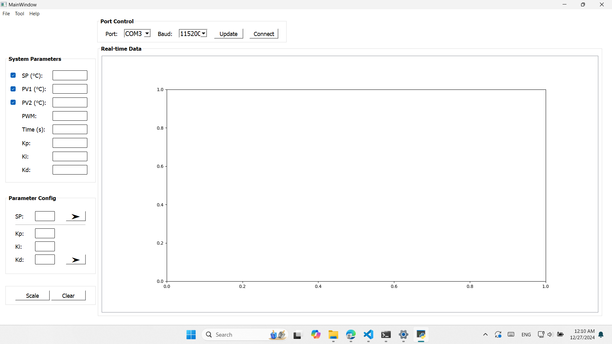

## Đề tài: Thiết kế và phát triển hệ thống điều khiển nhiệt độ sử dụng PID và giao thức MQTT

## Lời cảm ơn

- Lời đầu tiên cho tôi được gửi lời cảm ơn đến thầy Nguyễn Anh Tuấn, trong suốt thời gian qua thầy đã cung cấp những tài liệu và bài giảng giúp bản thân tôi và các thành viên trong lớp được nâng cao kiến thức về IoT và có thể làm những dự án đơn giản. Bên cạnh đó tôi xin cảm ơn các thầy trong bộ môn Tin học Vật lý đã tạo điều kiện để tôi có thể hoàn thành bài tập này.

## Mục lục
- Các thư mục của dự án bao gồm:
- **Thư mục PID TempBox_Pub**: [Link](https://github.com/Tungdeptraii/IoT-Project/tree/main/IoT-Final_Exam_PID%20TempBox/PID%20TempBox_Pub)
  - Là thư mục chứa code chính, bao gồm việc tính toán điều khiển nhiệt độ của hệ và truyền dữ liệu qua UART, truyền thông MQTT.
- **Thư mục PID TempBox_Sub**: [Link](https://github.com/Tungdeptraii/IoT-Project/tree/main/IoT-Final_Exam_PID%20TempBox/PID%20TempBox_Sub)
  - Là thư mục chứa code ESP32 có nhiệm vụ nhận thông tin nhiệt độ, độ ẩm được Public và hiển thị lên màn hình LCD, giúp người dùng có thể quan sát và theo dõi hoạt động của hệ.
- **Thư mục NodeRED**: [Link](https://github.com/Tungdeptraii/IoT-Project/tree/main/IoT-Final_Exam_PID%20TempBox/NodeRED)
  - Thư mục chứa mã của dự án NodeRED.
- **Thư mục GUI**: [Link](https://github.com/Tungdeptraii/IoT-Project/tree/main/IoT-Final_Exam_PID%20TempBox/GUI)
  - Thư mục chứa app được viết bằng python, truyền nhận dữ liệu thông qua giao tiếp UART.
- **Thư mục Wireless Connection**: [Link](https://github.com/Tungdeptraii/IoT-Project/tree/main/IoT-Final_Exam_PID%20TempBox/Wireless%20Connection)
  - Gồm hai thí nghiệm kết nối truyền nhận dữ liệu không dây của ESP32 là kết nối WiFi (Client-Server) và kết nối Bluetooth.
- **Thư mục Data**: [Link](https://github.com/Tungdeptraii/IoT-Project/tree/main/IoT-Final_Exam_PID%20TempBox/Data)
  - Chứa dữ liệu đo nhiệt độ của hệ dưới dạng file .csv.
- **Thư mục Images**: [Link](https://github.com/Tungdeptraii/IoT-Project/tree/main/IoT-Final_Exam_PID%20TempBox/Images)
  - Chứa ảnh của dự án.

## Đặt vấn đề:

- Trong các hệ thống công nghiệp và dân dụng, việc kiểm soát nhiệt độ chính xác là yếu tố then chốt để đảm bảo chất lượng và hiệu suất. Bộ điều khiển PID được đánh giá cao nhờ khả năng ổn định và hiệu chỉnh linh hoạt. Bên cạnh đó, giao thức MQTT trong IoT cho phép giám sát và điều khiển hệ thống từ xa một cách hiệu quả.

- Tuy nhiên, thách thức nằm ở việc tích hợp hai công nghệ này để tạo ra một hệ thống vừa ổn định, vừa đáp ứng được các yêu cầu thực tế. Đề tài tập trung vào xây dựng hệ thống ổn định nhiệt độ ứng dụng PID và MQTT, hướng đến một giải pháp thông minh, hiệu quả và linh hoạt.

## Mục tiêu:
Xây dựng một hệ thống giúp giám sát nhiệt độ phòng server theo thời gian thực, đưa ra cảnh báo kịp thời khi nhiệt độ vượt quá ngưỡng an toàn, và cho phép điều khiển từ xa thông qua giao thức MQTT.    

## Tổng quan về bộ điều khiển PID

Bộ điều khiển PID (Proportional-Integral-Derivative) là một thuật toán điều khiển phản hồi được sử dụng rộng rãi trong các hệ thống tự động hóa. Nó hoạt động dựa trên việc tính toán và điều chỉnh tín hiệu điều khiển để đạt được giá trị mong muốn (Setpoint - SP), thông qua ba thành phần chính:

- **Thành phần tỷ lệ (Proportional - P):**
  - Điều chỉnh tín hiệu điều khiển tỷ lệ với sai lệch hiện tại (Error = SP - PV).  
  - Giúp phản ứng nhanh với sai lệch lớn.
  - Thành phần tỷ lệ:
  
**Hình 1**

- **Thành phần tích phân (Integral - I):**
  - Tích lũy sai lệch qua thời gian để loại bỏ sai lệch lâu dài (offset).  
  - Đảm bảo hệ thống đạt được và duy trì giá trị mong muốn chính xác.
  - Thành phần tích phân:

  
**Hình 2**

- **Thành phần đạo hàm (Derivative - D):**
  - Phản ứng với tốc độ thay đổi của sai lệch để giảm hiện tượng dao động.  
  - Tăng cường độ ổn định của hệ thống.
  - Thành phần đạo hàm:

  
**Hình 3**

- **Công thức tổng quát của bộ điều khiển PID:**

  
**Hình 4**

- **Sơ đồ khối của bộ điều khiển PID:**
  
**Hình 5**

### Ứng dụng
Bộ điều khiển PID được sử dụng rộng rãi trong các lĩnh vực như:
- Điều khiển nhiệt độ, áp suất, lưu lượng.
- Điều khiển tốc độ, vị trí trong các hệ thống cơ điện tử.
- Ứng dụng trong IoT với các hệ thống thông minh.
- PID mang lại sự cân bằng giữa tốc độ, độ ổn định, và độ chính xác, là lựa chọn hàng đầu cho nhiều hệ thống điều khiển hiện đại.

## Sơ đồ khối dự án

**Hình 6**

## Linh kiện sử dụng

- ESP32 (Pub): Vi điều khiển chính.
- ESP32 (Sub): Nhận thông tin dữ liệu hiển thị lên LCD.
- ADS1115: ADC 16 bit giao tiếp I2C giúp tăng độ chính xác.
- LM35: Cảm biến nhiệt độ với tín hiệu analog.
- Mạch điều khiển: Điều khiển Peltier (sò nóng lạnh).
- Peltier: Sò nóng lạnh, dùng để điều khiển nhiệt độ.
- DHT11: Sử dụng để đo giá trị độ ẩm.
- Relay: Bật/tắt thiết bị khi cần.
- LCD: Hiển thị các thông số.

## Sơ đồ phần cứng

- Đầu vào của hệ được sử dụng nguồn DC.
- Mạch điều khiển sử dụng nguồn đầu vào 12V.
- Sơ đồ được vẽ mô tả trên Fritzing, chân D18 là chân xuất tín hiệu PWM vào mạch điều khiển Peltier

**Hình 7**

- Mạch hoàn chỉnh:

**Hình 8**

## Sơ đồ chân nối
- Chi tiết sơ đồ chân nối linh kiện được mô tả dưới bảng sau:

**Hình 9**

## Hình ảnh thực tế

- Hình ảnh mô hình:

**Hình 10**

- Mạch điện tử:

**Hình 11**

- Cảm biến LM35 được làm lại để đảm bảo ổn định trong quá trình hoạt động:

**Hình 12**

## Phần mềm và giao thức.

- PlatformIO/Arduino.
- Sử dụng bộ điều khiển PID để tạo ra tín hiệu PWM điều khiển mạch.
- Mạch điều khiển sẽ điều khiển điện áp vào Peltier để kiểm soát nhiệt độ.
- Giao tiếp UART: lấy thông tin dữ liệu hiển thị lên GUI nhằm theo dõi, điều khiển và lưu dữ liệu.
- Giao thức MQTT: trao đổi dữ liệu qua broker online.
- Cụ thể, sử dụng HiveMQ https://www.hivemq.com/
- Bảo mật: STL, Port 8883, lấy root ca-cert cho dịch vụ HiveMQ Serverless tại: https://letsencrypt.org/certs/isrgrootx1.pem 
- Sử dụng Node-RED, Dashboard để làm bảng theo dõi và điều khiển từ thiết bị cá nhân.
- Sử dụng thêm ESP32 làm Subcribe, nhận thông tin dữ liệu và hiển thị lên LCD giúp người dùng dễ dàng quản lý được hệ thống từ xa.

## GUI
- Được viết bằng Python, sử dụng thư viện PyQT5.
- Giao diện GUI:

**Hình 13**

**Hình 14**

## Cấu hình NodeRed

**Hình 15**

## Giao diện của Dashboard

**Hình 16**

## Hoạt động
- **Cảm biến**
- Cảm biến 1 (PV1) được sử dụng bộ lọc Kalman để đảm bảo dữ liệu nhiệt độ không bị nhiễu và gây ảnh hướng đến quá trình tính toán.
- Cảm biến 2 (PV2) không sử dụng lọc nhiễu, có tác dụng khảo sát và đo nhiệt độ của hệ.

- **Điều khiển PID**
- Dựa vào giá trị nhiệt độ mong muốn (Setpoint - SP) và giá trị nhiệt độ thực tế (Process Variable - PV), bộ điều khiển sẽ tính toán lỗi:
  - Lỗi (Error) = SP - PV.
- Bộ điều khiển sẽ tính toán lỗi theo ba thành phần:
  - Tỷ lệ (P): Phản ứng nhanh với sai lệch hiện tại.
  - Tích phân (I): Loại bỏ sai lệch lâu dài.
  - Đạo hàm (D): Giảm dao động, tăng ổn định.
- Tổng của ba thành phần này sẽ là biến điều khiển, điều khiển mạch cho Peltier sao cho sai số (Error) về mức nhỏ nhất.
- Thông qua giao tiếp UART và GUI, người dùng có thể theo dõi các giá trị thông số như: Setpoint, Process Variable, Kp, Ki, Kd, PWM, đồng thời điều khiển hệ thống và xuất file dữ liệu (.csv).
- Giao thức MQTT giúp người dùng theo dõi, quản lý và điều khiển hệ thống từ xa thông qua Node-Red Dashboard. Cùng với đó có thể theo dõi các thông tin như setpoint nhiệt độ, độ ẩm thông qua màn hình của thiết bị ESP32_Subcribe. 

## Demo video

[Watch the Demo Video](https://www.youtube.com/watch?v=3isMr8tyQCo)  

## Kết quả
- Hai cảm biến được đo đồng thời, cảm biến 1 (PV1) phục vụ tính toán PID, cảm biến 2 (PV2) khảo sát nhiệt.
- Nhiệt độ phòng 17.8°C, độ ẩm 61.3%. 
- Với Setpoint là 16, khảo sát hệ trong môi trường không khí, độ ẩm của hệ 56%.
- Dữ liệu sau khi lưu được xử lý bằng Python.
- Kết quả thu được như sau:

**Hình 17**

- Nhiệt độ trung bình PV1: 16.1430 °C
- Trung vị PV1: 16.0300 °C
- Độ lệch chuẩn PV1: 0.3542

**Hình 18**

- Nhiệt độ trung bình PV2: 16.1521 °C
- Trung vị PV2: 16.0445 °C
- Độ lệch chuẩn PV2: 0.3991

## Kết luận:

Bộ điều khiển PID kết hợp với truyền thông MQTT đã mang lại hiệu quả vượt trội trong việc điều khiển và giám sát nhiệt độ từ xa. Hệ thống không chỉ duy trì nhiệt độ ổn định với độ chính xác cao, giảm dao động và sai lệch, mà còn tận dụng khả năng truyền tải dữ liệu qua MQTT để giám sát và điều khiển từ xa một cách dễ dàng và linh hoạt.

Việc sử dụng MQTT giúp hệ thống có thể tích hợp vào các giải pháp IoT, cho phép người dùng theo dõi và điều chỉnh nhiệt độ mọi lúc, mọi nơi thông qua mạng internet. Kết hợp với khả năng điều khiển chính xác của PID, hệ thống này rất phù hợp cho các ứng dụng công nghiệp, dân dụng, hoặc các hệ thống tự động hóa thông minh, đảm bảo hiệu quả và tính ổn định cao.

## Hướng phát triển đề tài:

- Tối ưu và phát triên giao diện Node-Red Dashboard.
- Tối ưu hóa bộ điều khiển PID.
- Ứng dụng hệ trong các đề tài thực tế cần duy trì nhiệt độ.
- Tìm hiểu và ứng dụng bộ điều khiển Fuzzy mờ.

## Phụ lục: Một số thí nghiệm truyền thông không dây trên ESP32

- Thiết kế phần cứng:

**Hình 19**

- **Kết nối Bluetooth**
- Kết nối Bluetooth ESP32 với điện thoại thông qua app `Serial Bluetooth Terminal`
- Truyền nhận dữ liệu:

**Hình 20**

- Kết nối và truyền dữ liệu giữa hai ESP32 thông qua Bluetooth:

**Hình 6**

- **Kết nối WiFi (Client-Server)**

Dự án này mô phỏng kết nối WiFi giữa hai ESP32 sử dụng mô hình **Client-Server**, trong đó:
  - ESP32 thứ nhất hoạt động như một **Access Point (AP)** và phát WiFi.
  - ESP32 thứ hai sẽ kết nối vào WiFi mà ESP32 thứ nhất phát và hoạt động như một **Client**.

**Hình 22**

  - Kết nối điện thoại với WiFi của ESP32 AP và dùng trình duyệt, truy cập vào địa chỉ 192.168.4.1.
  - Client (điện thoại) gửi yêu cầu HTTP đến Server (ESP32) qua mạng WiFi.
  - Server (ESP32) nhận và xử lý yêu cầu, rồi trả về phản hồi HTTP.

**Hình 23**