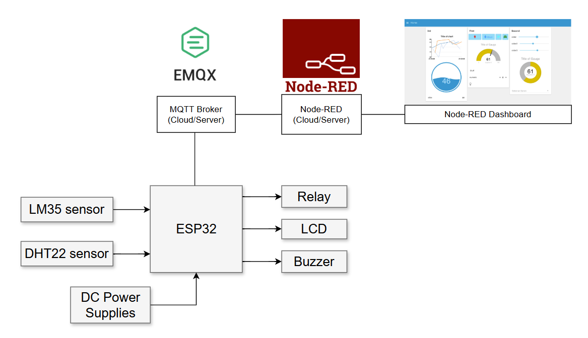

## Đề tài: Xây dựng hệ thống giám sát nhiệt độ và cảnh báo cho phòng server qua MQTT

## Đặt vấn đề:

- Phòng server là nơi chứa các thiết bị quan trọng như máy chủ, bộ lưu trữ dữ liệu và thiết bị mạng. Những thiết bị này thường phát sinh nhiệt lớn trong quá trình hoạt động. Nếu nhiệt độ phòng không được kiểm soát, các thiết bị có thể bị hỏng hóc, dẫn đến thiệt hại lớn về dữ liệu và gián đoạn dịch vụ.

- Thực tế, phòng tính toán hiệu năng cao thuộc bộ môn Tin học Vật lý đôi khi cũng xảy ra tình trạng quá tải nhiệt nhất là trong những ngày hè nóng. Người quản lý cũng không thể dành toàn thời gian để giám sát nhiệt độ, chính vì thế ý tưởng của đề tài này nhằm phục vụ mục đích giám sát các thông số như nhiệt độ, độ ẩm của phòng server đồng thời đưa ra cảnh báo kịp thời với người quản lý để tránh xảy ra những vấn đề không mong muốn.

## Mục tiêu:
Xây dựng một hệ thống giúp giám sát nhiệt độ phòng server theo thời gian thực, đưa ra cảnh báo kịp thời khi nhiệt độ vượt quá ngưỡng an toàn, và cho phép điều khiển từ xa thông qua giao thức MQTT.    

## Sơ đồ khối dự án

**Hình 1**

## Linh kiện sử dụng

- ESP32: Vi điều khiển chính.
- LM35: Cảm biến nhiệt độ với tín hiệu analog giúp nâng cao độ chính xác.
- DHT22: Sử dụng để đo giá trị độ ẩm.
- Relay: Bật/tắt thiết bị khi cần.
- Buzzer: Đưa ra tín hiệu cảnh báo.
- LCD: Hiển thị các thông số.

## Phần mềm và giao thức.

- PlatformIO/Arduino.
- Giao thức MQTT: trao đổi dữ liệu qua broker online. 
- Sử dụng Node-RED, Dashboard để làm bảng theo dõi và điều khiển từ thiết bị cá nhân.