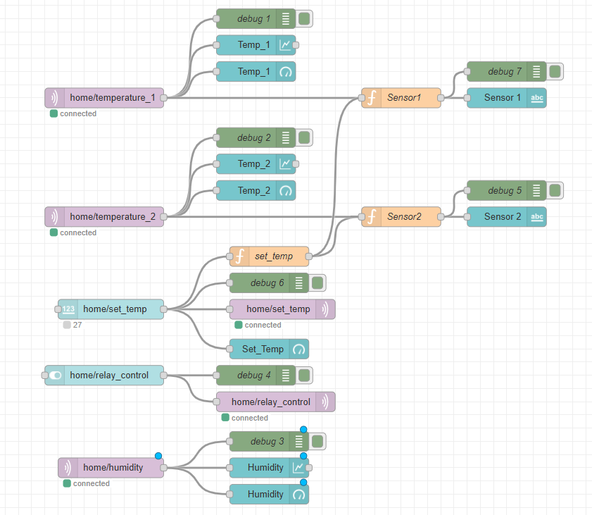

## Đề tài: Xây dựng hệ thống giám sát nhiệt độ và cảnh báo cho phòng server qua MQTT

## Lời cảm ơn

- Lời đầu tiên cho tôi được gửi lời cảm ơn đến thầy Nguyễn Anh Tuấn, trong suốt thời gian qua thầy đã cung cấp những tài liệu và bài giảng giúp bản thân tôi và các thành viên trong lớp được nâng cao kiến thức về IoT và có thể làm những dự án đơn giản. Bên cạnh đó tôi xin cảm ơn các thầy trong bộ môn Tin học Vật lý đã tạo điều kiện để tôi có thể hoàn thành bài tập này.

## Đặt vấn đề:

- Phòng server là nơi chứa các thiết bị quan trọng như máy chủ, bộ lưu trữ dữ liệu và thiết bị mạng. Những thiết bị này thường phát sinh nhiệt lớn trong quá trình hoạt động. Nếu nhiệt độ phòng không được kiểm soát, các thiết bị có thể bị hỏng hóc, dẫn đến thiệt hại lớn về dữ liệu và gián đoạn dịch vụ.

- Thực tế, phòng tính toán hiệu năng cao thuộc bộ môn Tin học Vật lý đôi khi cũng xảy ra tình trạng quá tải nhiệt nhất là trong những ngày hè nóng. Người quản lý cũng không thể dành toàn thời gian để giám sát nhiệt độ, chính vì thế ý tưởng của đề tài này nhằm phục vụ mục đích giám sát các thông số như nhiệt độ, độ ẩm của phòng server đồng thời đưa ra cảnh báo kịp thời với người quản lý để tránh xảy ra những vấn đề không mong muốn.

## Mục tiêu:
Xây dựng một hệ thống giúp giám sát nhiệt độ phòng server theo thời gian thực, đưa ra cảnh báo kịp thời khi nhiệt độ vượt quá ngưỡng an toàn, và cho phép điều khiển từ xa thông qua giao thức MQTT.    

## Sơ đồ khối dự án

**Hình 1**

## Linh kiện sử dụng

- ESP32: Vi điều khiển chính.
- LM35: Cảm biến nhiệt độ với tín hiệu analog giúp nâng cao độ chính xác.
- DHT22: Sử dụng để đo giá trị độ ẩm.
- Relay: Bật/tắt thiết bị khi cần.
- Buzzer: Đưa ra tín hiệu cảnh báo.
- LCD: Hiển thị các thông số.

## Sơ đồ phần cứng
- Đầu vào của hệ được sử dụng nguồn 5V-DC
- Sơ đồ được vẽ mô tả trên Fritzing

**Hình 2**

## Sơ đồ chân nối
- Chi tiết sơ đồ chân nối linh kiện được mô tả dưới bảng sau:

**Hình 3**

## Hình ảnh thực tế mô hình

**Hình 4**

## Phần mềm và giao thức.

- PlatformIO/Arduino.
- Giao thức MQTT: trao đổi dữ liệu qua broker online.
- Cụ thể, sử dụng HiveMQ https://www.hivemq.com/
- Bảo mật: STL, Port 8883, lấy root ca-cert cho dịch vụ HiveMQ Serverless tại: https://letsencrypt.org/certs/isrgrootx1.pem 
- Sử dụng Node-RED, Dashboard để làm bảng theo dõi và điều khiển từ thiết bị cá nhân.

## Cấu hình NodeRed

**Hình 5**

## Giao diện của Dashboard

**Hình 6**

## Hoạt động
- Hệ thống lấy thông tin cảm biến và nhiệt độ truyền dữ liệu này qua MQTT.
- Thông tin này được hiển thị lên Dashboard của Node-RED.
- Người dùng có thể theo dõi được nhiệt độ phòng máy chủ.
- Khi nhiệt độ vượt quá ngưỡng nhiệt cho phép, thông báo sẽ được đưa ra giúp người quản lý có hướng xử lý kịp thời.
- Tại giao diện Dashboard, người dùng có thể bật tắt thiết bị điện (tùy ý) từ xa bằng cách điều khiển relay hoặc thay đổi ngưỡng nhiệt độ cảnh báo.

## Kết quả

- Khi nhiệt độ ở trạng thái an toàn, trên Dashboard sẽ hiển thị:

**Hình 7**

- Khi nhiệt độ vượt quá ngưỡng, thông báo sẽ hiển thị:

**Hình 8**

- Điều chỉnh ngưỡng nhiệt độ:

 
**Hình 9**

- Có thể điều chỉnh bật/tắt relay:

**Hình 10**

- Với phần cứng: Người dùng có thể quan sát trực tiếp nhiệt độ thông qua LCD và khi nhiệt độ vượt ngưỡng, còi sẽ được bật.

**video 1**
